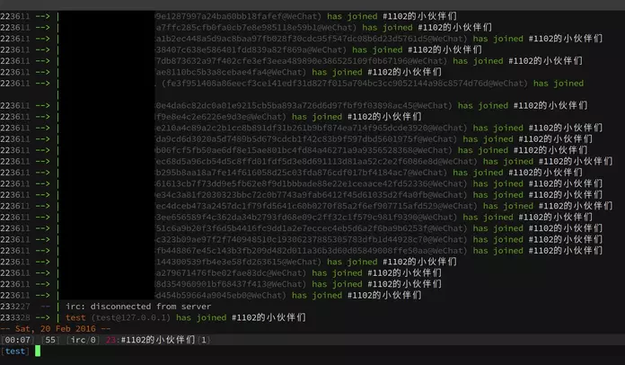

# wechatircd

用IRC客户端收发微信朋友、群消息。



## 原理

修改网页版微信用的JS，通过WebSocket把信息发送到服务端，服务端兼做IRC服务端，把IRC客户端的消息通过WebSocket传送到网页版JS以投递。

## 安装

Chrome：安装Switcheroo Redirector扩展，把<https://res.wx.qq.com/zh_CN/htmledition/v2/js/webwxApp2aeaf2.js>重定向至项目根目录下的`webwxapp.js`，要用一个添加`Access-Control-Allow-Origin: *` header的HTTP server伺服，比如：<http://127.1:8000/webwxapp.js>

## 运行

- `./wechatircd.py`启动WebSocket与IRC server
- 访问<https://wx.qq.com>，确保其中的<https://res.wx.qq.com/zh_CN/htmledition/v2/js/webwxApp2aeaf2.js>已经重定向到修改版了
- IRC客户端连接127.1:6667，自动加入了`+status` channel，记录32个十六进制数字的token (UUID Version 1)，在网页版微信里对“文件传输助手”(filehelper)或其他人/群(还是不要骚扰别人吧)发这个token
- 在`+status`里有所有微信朋友的nick，nick优先选取备注名(`RemarkName`)，其次为`DisplayName`(原始js根据昵称等自动填写的一个名字)
- 自动加入各微信组

如果微信网页版显示QR code要求重新登录，登录后继续对“文件传输助手”32个十六进制数字的token即可。
服务端或客户端重启，根据`+status` channel上新的token(或者在`+status` channel发送`new`消息重新获取一个)，在微信网页版上对“文件传输助手”输入token。

## JS改动

原始文件`orig/webwxApp2aeaf2.js`在Chrome DevTools里格式化后得到`orig/webwxApp2aeaf2.pretty.js`，可以用`diff -u orig/webwxApp2aeaf2.pretty.js webwxapp.js`查看改动。

## FAQ

### 选择这个办法的理由

原本想研究微信网页版登录、收发消息的协议，自行实现客户端。参考过<https://github.com/0x5e/wechat-deleted-friends>，仿制了<https://gist.github.com/MaskRay/3b5b3fcbccfcba3b8f29>，可以登录。但根据minify后JS把相关部分重写非常困难，错误处理很麻烦，所以就让网页版JS自己来传递信息。

### 为什么采用JS重定向？

微信网页版使用AngularJS，不知道如何优雅地monkey patch AngularJS……一旦原JS执行了，bootstrap了整个页面，我不知道如何用后执行的`<script>`修改它的行为。

因此原来打算用UserScript阻止该`<script>`标签的执行，三个时机里`@run-at document-begin`看不到`<body>`；`document-body`时`<body>`可能只部分加载了，旧`<script>`标签已经在加载过程中，添加修改后的`<script>`没法保证在旧`<script>`前执行；`@run-at document-end`则完全迟了。

另外可以在`@run-at document-begin`时`window.stop()`阻断页面加载，然后换血，替换整个`document.documentElement`，先加载自己的小段JS，再加载<https://res.wx.qq.com/zh_CN/htmledition/v2/js/{libs28a2f7,webwxApp2aeaf2}.js>，详见<http://stackoverflow.com/questions/11638509/chrome-extension-remove-script-tags>。我不知道如何控制顺序。另外，两个原有JS的HTTP回应中`Access-Control-Allow-Origin: wx.qq.com`格式不对，浏览器会拒绝XMLHttpRequest加载。

Firefox支持beforescriptexecute事件，可以用UserScript实现劫持、更换`<script>`。

### 查看微信网页版当前采用的token

DevTools console里查看`token`变量

## 网上搜集的AngularJS控制网页版微信方法

联系人列表
```javascript
angular.element('div[nav-chat-directive]').scope().chatList
```

当前窗口发送消息
```javascript
angular.element('pre:last').scope().editAreaCtn = "Hello，微信";
angular.element('pre:last').scope().sendTextMessage();
```

## 参考

- [miniircd](https://github.com/jrosdahl/miniircd)
